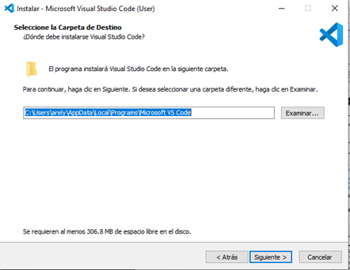
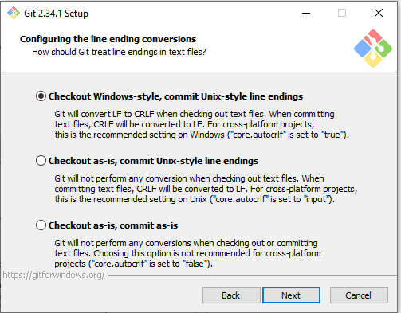

# **Práctica ProContacto**
       EJERCICIO 1

Instalación del ambiente

El presente ejercicio busca realizar la instalación del ambiente para el desarrollo del trabajo práctico. 

1. Instalar el IDE Visual Studio Code: Un IDE (Entorno  e desarrollo integrado), es una aplicación que nos brinda facilidades al momento de generar código. 

* Ingresa al link de Visual Studio Code https://code.visualstudio.com/, selecciona el sistema operativo y da clic en descargar. 

* Una vez terminada la descarga, da clic en el botón ejecutar para que se ejecute como administrador y prosiga la instalación. 
 

* Acepta términos y condiciones y da clic en el botón siguiente.

   

* Selecciona la carpeta en donde se instalara el programa y da clic en siguiente:
 

* Da clic en siguiente, aquí solo se indica que creara un acceso directo

 

* Selecciona las tareas adicionales que deseas añadir, da clic en siguiente: 

* Da clic en instalar, aquí solo se muestran la carpeta destino, es decir, donde se instalara el programa:

* Una vez instalado, se abre automáticamente Visual Studio Code:

 

2. Instalar GIT y GIT Bash: Git es una aplicación utilizada para el control de versionado de código. En otras palabras, es una suerte de “disco” en donde se guardarán los distintos files que componen nuestra aplicación (ejemplo: index.html, estilos.css, etc). La gran ventaja de GIT es que al momento de subir una versión nueva de un archivo, genera un “backup” de la versión anterior para poder ser restaurado cuando se desee. Además, el código se encuentra en la “nube”, por lo que puede ser accedido y descargado desde cualquier lugar que tenga acceso a internet.

* Ingrese a la pag http://git-scm.com/download/win para descargar GIT, da clic en “Haga clic para descargar” :

* Una vez descargada, da clic en ejecutar como administrador, da clic en “Si”:

* Acepta la licencia, da clic en Next: 

* Selecciona la carpeta de destino de instalación, y da clic:

* Selecciona los componentes a añadir, da clic en Next:

* Selecciona la carpeta de menú de inicio, clic en Next:

* Elige el editor de código con el que desees utilizar Git, en este caso utiliza Visual Studio Code, dar clic en Next:

* Ajusta el nombre inicial en nuevos repositorios si asi lo deseas, sino deja que GIT lo decida:

* Ajuste el entorno PATH, es decir, selecciona como usar GIT, puede ser desde terceros con GIT Bash, posteriormente da clic en Next:

* Elige el ejecutable SSH, da clic:

* Elige el el backend de transporte HTTPS, da clic:

* Configura las líneas de conversiones:  

* Configura el enmulador de la terminal  para usar GIT:

* Elige el comportamiento predeterminado para GIT:

* Elige un asistente de credenciales, da clic en Next:

* Configuración de opciones adicionales:

* Instalación  GIT:

 
* Una vez finalizada la instalación  completa el asistente de configuración, inicia el GIT Bash, da clic en Finish:

 
* Como se observa, ya esta instalado GIT Bash en nuestro sistema operativo:
 
 
       EJERCICIO 2

Las siguientes preguntas están orientadas a la comprensión del protocolo HTTP. Son agnósticas al lenguaje de programación, la idea es comprender los conceptos del estándar:
1. ¿Qué es un servidor HTTP? 

    Se dice servidor web que utiliza el protocolo HTTP (Protocolo de Transferencia de Hiper Texto), es decir, es aquel  programa que procesa una aplicación del lado del servidor (solicitante-servidor)

2. ¿Qué son los verbos HTTP? Mencionar los más conocidos

    Los métodos de petición o verbos se utilizan  para indicar la acción que se desea realizar para un recurso determinado. 

    * **GET:** solicita una representación de un recurso específico. Las peticiones que usan el método GET sólo deben recuperar datos.
    * **HEAD:** pide una respuesta idéntica a la de una petición GET, pero sin el cuerpo de la respuesta.
    * **POST:** se utiliza para enviar una entidad a un recurso en específico, causando a menudo un cambio en el estado o efectos secundarios en el servidor.
    * **PUT:** reemplaza todas las representaciones actuales del recurso de destino con la carga útil de la petición.
    * **DELETE:** borra un recurso en específico.
    * **CONNECT:** establece un túnel hacia el servidor identificado por el recurso.
    * **OPTIONS:** utilizado para describir las opciones de comunicación para el recurso de destino.
    * **TRACE:** realiza una prueba de bucle de retorno de mensaje a lo largo de la ruta al recurso de destino.
    * **PATCH:** utilizado para aplicar modificaciones parciales a un recurso.

3. ¿Qué es un request y un response en una comunicación HTTP? 

    Un request es aquel que hace una solicitud para obtener información, permite el acceso a toda la información que pasa desde el navegador del cliente al servidor. 
    Un response es el mensaje que envía el servidor al cliente tras haber recibido una petición o HTTP request, es decir toda la infomacion que vemos desde nuestro navegador.

4. ¿Qué son los headers? 

    Los headers o encabezados HTTP permiten que el cliente y el servidor pasen información adicional con una solicitud o respuesta HTTP. Un encabezado HTTP consta de su nombre, que no distingue entre mayúsculas y minúsculas, seguido de dos puntos ( :) y luego de su valor (nombre de la página).

5. ¿Qué es un queryString? (En el contexto de una url)

    Es aquel que se utiliza para hacer referencias a una interacción con una base de datos. Es la parte de la URL que contiene los datos que deben pasar a las aplicaciones web.

6. ¿Qué es el responseCode? ¿Qué significado tiene los posibles valores devueltos?

    Es un código de respuesta (similar a los códigos de estado HTTP) que indica si la solicitud de codificación geográfica se ha realizado correctamente o no.
    Los códigos de estado de respuesta HTTP indican si se ha completado satisfactoriamente una solicitud HTTP específica. 
    Respuestas informativas (100–199), Respuestas satisfactorias (200–299), Redirecciones (300–399), Errores de los clientes (400–499),
    Errores de los servidores (500–599).

7. ¿Cómo se envía la data en un Get y cómo en un POST? 

    GET es  utilizado por el navegador para pedir al servidor que se envíe de vuelta un recurso dado: "Hey servidor, quiero conseguir este recurso." En este caso, el navegador envía un cuerpo vacío. Debido a que el cuerpo está vacío, si un formulario se envía utilizando este método, los datos enviados al servidor se anexan a la URL.
    Mientras el método POST que el navegador utiliza para comunicarse con el servidor cuando se pide una respuesta que tenga en cuenta los datos proporcionados en el cuerpo de la petición HTTP: "Hey servidor, echa un vistazo a estos datos y envíame de vuelta un resultado apropiado." Si un formulario se envía utilizando este método, los datos se anexan al cuerpo de la petición HTTP.

8. ¿Qué verbo http utiliza el navegador cuando accedemos a una página? 
    Post

9. Explicar brevemente qué son las estructuras de datos JSON y XML dando ejemplo de estructuras posibles.

* **JSON:** formato ligero de intercambio de datos, está  constituido por dos estructuras:
    * Una colección de pares de nombre/valor. En varios lenguajes esto es conocidos como un objeto, registro, estructura, diccionario, tabla hash, lista de claves o un arreglo asociativo.
    * Una lista ordenada de valores. En la mayoría de los lenguajes, esto se implementa como arreglos, vectores, listas o secuencias.

* **XML:** permite garantizar el intercambio de cualquier tipo de información sin que ocasione problemas de tipo contenido o tipo presentación. XML están conformadas por elementos, elementos secundarios anidados y atributos que Analytics identifica al analizar un archivo XML. Se muestran en la vista de árbol Estructuras de datos XML, que es una representación jerárquica del archivo XML. Cada estructura de datos 
    * XML está representada por un icono de tabla   y el nombre del elemento 
    * XML y los atributos o elementos anidados que contiene.
     

10.	Explicar brevemente el estándar SOAP

  imple Object Access Protocol-Protocolo estándar basado en el lenguaje XML, define como dos objetos en diferentes procesos se pueden comunicar a través del intercambio de datos XML

11.	Explicar brevemente el estándar REST Full

    Un conjunto de principios y patrones de comunicación que ayudan a crear una forma de pensar y construir las APIs. Este tipo de arquitectura se define por un conjunto de restricciones entre los elementos, componentes, conectores y datos usados.(Un modelo cliente-servidor, Un protocolo sin estado (o stateless), Cacheable)

12. ¿Qué son los headers en un request? 

    Headers son la parte central de los HTTP requests y responses, y transmiten información acerca del navegador del cliente, de la página solicitada del servidor.

13. ¿Para qué se utiliza el key Content-type en un header?

    Content-Type propiedad de cabecera (header) usada para indicar el  media type (en-US) del recurso. Content-Type dice al cliente que tipo de contenido será retornado

        EJERCICIO 3
Descargar  POSTMAN (aplicación para realizar request como cliente), adjuntando un screen de resolución para cada ítem:

1.	Realizar un request GET a la URL: https://procontacto-reclutamiento-default-rtdb.firebaseio.com/contacts.json

2.	Realizar un request POST a la URL anterior, y con body:

    {

    "name":"Tu nombre",
    "email":tunombre.tuapellido@procontacto.com.mx

    }

    Tip: (Marcar la opción “raw” como body)
   

3.	Realizar nuevamente un request GET a la URL: https://procontacto-reclutamiento-default-rtdb.firebaseio.com/contacts.json
 
 * ¿Qué diferencias se observan entre las llamadas el punto 1 y 3? 
 Agrego mis datos de contacto, nombre y correo electrónico, además de un número de identificación por así decirlo.

        EJERCICIO 4

Realizar los siguientes módulos de Trailhead:

[* Fundamento de la plataforma Salesforce](https://trailhead.salesforce.com/es-MX/content/learn/modules/platform_dev_basics)

[* Fundamentos de Apex y .NET](https://trailhead.salesforce.com/es-MX/content/learn/modules/apex_basics_dotnet)

[* Modelado de datos](https://trailhead.salesforce.com/es-MX/content/learn/modules/data_modeling)

[* Fundamentos y base de datos de Apex](https://trailhead.salesforce.com/es-MX/content/learn/modules/apex_database)

[* Desencadenadores de Apex](https://trailhead.salesforce.com/es-MX/content/learn/modules/apex_triggers)

[* Apex Integration Services](https://trailhead.salesforce.com/en/content/learn/modules/apex_integration_services)

[Arely trailblazer](https://trailblazer.me/id/acortes52)

        EJERCICIO 5
Explicación conceptualmente, qué datos almacenan en forma estándar y cómo se relacionan el resto (algunos no se relacionan entre sí) cada uno de los siguientes objetos de Salesforce:

**1. Lead**

 Representa un prospecto o cliente potencial.

**2. Account (Cuentas)**

 Son las empresas con las que establecemos una relación de negocios. Pueden tambien ser personas en caso que se requiera. El objeto Cuentas tiene una serie de campos estandar por medio de los cuales se puede guardar información como la razón social, dirección postal, ciudad, país, teléfono principal, etc, etc.

**3. Contact (Contactos)**

Son personas que trabajan al interior de las empresas con las que hace negocios (Cuentas). Al igual que en el caso anterior, puede registrar una serie de datos como el nombre, dirección de e-mail, cargo, RUT, etc.

**4. Opportunity**

Prospectos calificados a los que ha convertido. Al convertir a un prospecto, crea una cuenta y un contacto junto con la oportunidad y es en esta última donde se almacena toda la gestión comercial que el vendedor realiza para ofertar los productos.

**5. Product**

Representa un producto que vende su organización.
Este objeto tiene varios campos que se usan solo para programaciones de cantidad e ingresos. Los cronogramas están disponibles solo para organizaciones que han activado las funciones de productos y cronogramas. 

**6. PriceBook** 

El libro de precios estándar es la lista maestra de todos sus productos y sus precios estándar predeterminados. Salesforce crea el libro de precios estándar cuando comienza a crear registros de productos. Incluye todos sus productos y sus precios estándar, independientemente de cualquier libro de precios personalizado que incluya esos productos.

**7. Quote**

Las cotizaciones en Salesforce representan los precios propuestos de los productos y servicios de su empresa. Usted crea una cotización a partir de una oportunidad y sus productos. Cada oportunidad puede tener varias cotizaciones asociadas y cualquiera de ellas se puede sincronizar con la oportunidad.

**8. Asset**

Representa un artículo de valor comercial, como un producto vendido por su empresa o un competidor, que un cliente ha comprado e instalado mientras que los productos representan los artículos que vende su empresa, los activos representan los productos específicos que sus clientes han comprado. Utilice activos para almacenar información sobre los productos de sus clientes.

**9. Case**

Representa un caso, que es un asunto o problema del cliente.

**10. Article**

Su base de conocimientos de Salesforce se crea a partir de artículos de conocimientos, que son documentos de información. Los artículos pueden incluir información sobre el proceso, como cómo restablecer su producto a sus valores predeterminados, o preguntas frecuentes, como cuánto almacenamiento admite su producto.

[Diagrama](img/práctica.drawio.png)

        EJERCICIO 6
Realizar las siguientes actividades sobre el Playground 1 del ejercicio 4:

A.	Consultar tu ID haciendo un GET con POSTMAN a este WS:
https://procontacto-reclutamiento-default-rtdb.firebaseio.com/contacts.json

* Id

B.	Agregar un campo al objeto Contact llamado idprocontacto de tipo texto de 255 caracteres. De la siguiente manera:

* Haga clic en la ficha Object Manager (Gestor de objetos). Desde la lista de objetos en el menú desplegable, => clic en Suggestion (Sugerencia). => clic en la sección Fields & Relationships (Campos y relaciones)=>New, posteriormente le saldra la siguiente ventana en la que pondra el nombre de la etiqueta y el tamaño de la misma.

* Seleccione la casilla ""Visible" esto para adjuntar componentes, posteriormente clic en Next y el objeto se habra creado satisfactoriamente.

* Se redirecciona al inicio, como se observa el objeto se creo y muestra sus características.

C.	Desarrollar un trigger para que cuando un usuario Modifica o Crea un contacto de Salesforce completando el campo generado el punto B con el ID del punto A, se invoque al Web Service con el idprocontacto obtenga los datos de email de la respuesta y actualice el campo email del contacto. Usar Playground 1. 

        EJERCICIO 7
### **Soluciones de Salesforce**
A. ¿Qué es Salesforce? 

Es una solución de gestión de relaciones con clientes que une empresas y clientes además de ser una solución basada en la nube con suscripción individual por usuario  y que cuenta con un periodo de prueba gratuita.

B.	¿Qué es Sales Cloud?

Es una plataforma de ventas que da seguimiento al proceso de ventas, desde perfilar prospectos, hacer el contacto inicial hasta el final de la compra.

C.	¿Qué es Service Cloud?

Ayuda a las empresas ya consolidadas que quieren impulsar la satisfacción del cliente, consta de diferentes módulos y cada uno tiene su propia licencia, con ello los clientes pueden adquirir aquellos que se apegan más a su actividad. Salesforce Service Cloud ayuda a las compañías a mejorar la satisfacción del cliente por medio de un acceso fácil a las capacidades de autoayuda y al agilizar todas las interacciones de servicio.

D.	¿Qué es Health Cloud?

Permite una conversación personalizada entre el paciente y las entidades sanitarias asociadas. No solo es beneficioso para los equipos de atención médica, sino que también beneficia a los pacientes al establecer comunicaciones digitales con su equipo de atención.

E.	Qué es Marketing Cloud?

Sirve para crear y automatizar campañas de marketing. Al enlazar esta gestión con la de ventas, es más fácil llegar a los clientes potenciales, crear campañas y hablar uno a uno. En este sentido, Salesforce cuenta con dos productos: El primero es Pardot, donde el marketing se dirige de empresas hacia empresas y el segundo es  Salesforce Marketing Cloud, el cual permite hacer marketing de empresas hacia clientes finales.

### **Funcionalidades de Salesforce**
A.	¿Qué es un RecordType?

Es un tipo de registro que se puede utilizar cuando un objeto en Salesforce es usado para multiples propósitos, y debe mostrar diferente información en su respectivo Page Layout

B.	¿Qué es un ReportType?

Indica el tipo de informe al que pertenece la plantilla seleccionada previamente por el creador de la misma.

C.	¿Qué es un Page Layout?

Diseño de página en Salesforce nos permite personalizar el diseño y la organización de detalles y editar páginas de registros en Salesforce.

D.	¿Qué es un Compact Layout?

Los   formatos compactos controlan qué campos aparecen en el encabezado, para cada objeto, puede asignar hasta 10 campos, incluyendo el campo Nombre, para mostrar en esa área.

E.	¿Qué es un Perfil?

Los perfiles definen cómo acceden los usuarios a objetos y datos y qué pueden hacer en la aplicación. Cuando cree usuarios, asigne un perfil a cada uno.

F.	¿Qué es un Rol?

Los roles son aquellos que controlan el nivel de visibilidad que un usuario tiene sobre los datos de su organización.

G.	¿Qué es un Validation Rule?

Las reglas de validación verifican que los datos ingresados por usuarios en registros cumplen los estándares que especifica antes de poder guardarlos. Una regla de validación puede contener una fórmula o expresión que evalúa los datos en uno o más campos y ofrece un valor “Verdadero” o “Falso”.

H.	¿Qué diferencia hay entre una relación Master Detail y Lookup?

La diferencia clave es que el maestro-detalle tiene una dependencia directa entre los objetos:
No puede tener un registro de detalle sin un maestro. No puede actualizar la relación con el maestro en una relación maestro-detalle.
Buscar relación crea relaciones entre dos objetos.
Si eliminamos cualquier objeto, entonces otro objeto no se elimina.

I.	¿Qué es un Sandbox?

Es una copia de su organización en un entorno aislado que puede usar para distintos fines, como pruebas y capacitación.

J.	¿Qué es un ChangeSet?

Es aquel que sirve para enviar personalizaciones de una organización de Salesforce a otra.

K.	¿Para qué sirve el import Wizard de Salesforce?

Facilita el proceso de importación de datos para varios objetos de Salesforce, incluyendo cuentas, contactos, candidatos, soluciones, miembros de campañas y cuentas personales. También puede importar datos para objetos personalizados.

L.	¿Para qué sirve la funcionalidad Web to Lead?

Sirve para dirigirte a tus clientes deseados y recolectar información importante sobre ellos, sus preferencias y necesidades. Resolver dudas o consultas de tus clientes potenciales y actuales.

M.	¿Para qué sirve la funcionalidad Web to Case?

Recopile las solicitudes de servicio de atención al cliente directamente del sitio web de su compañía y genere automáticamente casos nuevos con Caso Web. Para configurar Casos Web, active la función, cree y personalice su formulario web y agregue el formulario a su sitio web.

N.	¿Para qué sirve la funcionalidad Omnichannel?

La funcionalidad Omnichannel  la cual una vez habilitada se puede configurar de forma que permite que un agente, bajo una misma pantalla, pueda recibir casos que hayan entrado a la plataforma a través de un correo electrónico, o bien un chat, etc., canales que se pueden dar de alta en Service Channels bajo esta herramienta.

O.	¿Para qué sirve la funcionalidad Chatter?

herramienta de comunicación dentro de Salesforce.com diseñada especialmente para la interacción y retroalimentación instantánea, el intercambio de archivos y la utilización de encuestas entre los miembros de tu departamento comercial.

### **Conceptos generales** 
A.	¿Qué significa SaaS? 

El software como servicio (SaaS) permite a los usuarios conectarse a aplicaciones basadas en la nube a través de Internet y usarlas

B.	¿Salesforce es Saas?

Si, debido a que salesforce nace como resultado de una aplicación de desarrollo de software del modelo SaaS

C.	¿Qué significa que una solución sea Cloud?

Que es una tecnología que permite acceso remoto a softwares, almacenamiento de archivos y procesamiento de datos por medio de Internet, siendo así, una alternativa a la ejecución en una computadora personal o servidor local

D.	¿Qué significa que una solución sea On-Premise?

Que esta instalación se lleva a cabo dentro del servidor y la infraestructura (TIC) de la empresa. ... Con el modelo on-premise, la empresa es la responsable de la seguridad, disponibilidad y gestión del software

E.	¿Qué es un pipeline de ventas?

Es aquel que permite que tu empresa sea capaz de administrar de forma automática y en tiempo real todos los acuerdos de venta.

F.	¿Qué es un funnel de ventas?

El concepto de embudo de ventas representa todo el proceso de cierre de un negocio, desde el momento de la captación hasta la conversión final. Es el acompañamiento de un cliente desde el momento en que tiene el primer contacto con los productos o servicios de tu empresa hasta el momento en que la venta es cerrada.

G.	¿Qué significa Customer Experience?

Customer Experience (CX), o Experiencia del Cliente  es como se llama al conjunto de percepciones e impresiones que un consumidor posee sobre una determinada empresa tras interactuar con ella, ya sea online o en vivo

H.	¿Qué significa omnicanalidad?

Asigna elementos de trabajo a una cola y luego distribuye los elementos de trabajo a un agente que es un miembro de esa cola. Funciona de forma nativa en Salesforce. Es óptimo para organizaciones de reducido tamaño que admiten un número limitado de productos.

I.	¿Qué significa que un negocio sea B2B?

Modelo de negocio que consiste en los servicios que una compañía entrega a otra con el objetivo de mejorar las ventas de los productos y bienes que ofrece. Es decir, una transacción comercial entre empresas

J.	¿Qué significa que un negocio sea B2C?

Que una empresa le vende de forma directa al consumidor final. Este modelo es el de las empresas que ofrecen bienes y servicios de consumo masivo.

K.	¿Qué es un KPI?

Los indicadores claves de desempeño o KPIs son todas las variables, factores y unidades de medida para generar una estrategia de marketing.

L.	¿Qué es una API y en qué se diferencia de una Rest API?

API es un conjunto más general de protocolos y se implementa sobre el software para ayudarlo a interactuar con algún otro software,.Una API, o interfaz de programación de aplicaciones, es un conjunto de reglas que determinan cómo las aplicaciones o los dispositivos pueden conectarse y comunicarse entre sí. Una API REST es una API que se ajusta a los principios de diseño de REST, un estilo de arquitectura también denominado.

M.	¿Qué es un Proceso Batch?

Es un sistema que induce a la producción de cantidades finitas de material, sometiendo las cantidades de material de entrada a un conjunto ordenado de actividades de procesamiento sobre un periodo finito de tiempo, usando uno o más recursos.

N.	¿Qué es Kanban?

Es aquella que controla el importe o el número total en cada encabezado de columna (1) y las agrupaciones de columnas (2). Resuma cada columna por un número o importe clave, como importe de oportunidad o ingresos previstos.

O.	¿Qué es un ERP? 

Enterprise Resource Planning  (Planificación de Recursos Empresariales) es un conjunto de sistemas de información que permite la integración de ciertas operaciones de una empresa, especialmente las que tienen que ver con la producción, la logística, el inventario, los envíos y la contabilidad.

P.	¿Salesforce es un ERP?

Se podría decir que si debido a que complementa las plataformas de planificación de recursos de negocio (ERP) mediante la conversión de los datos de la gestión de procesos desde el prospecto hasta el pedido de Salesforce CPQ en datos de transacciones
